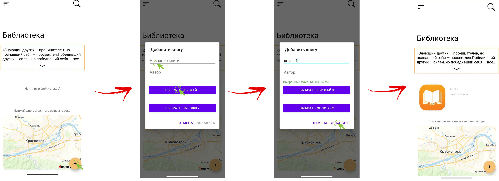
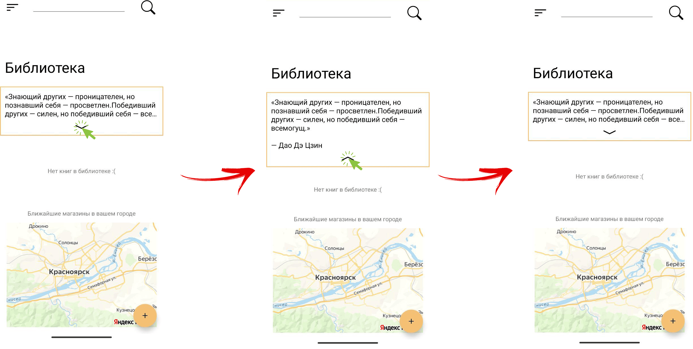
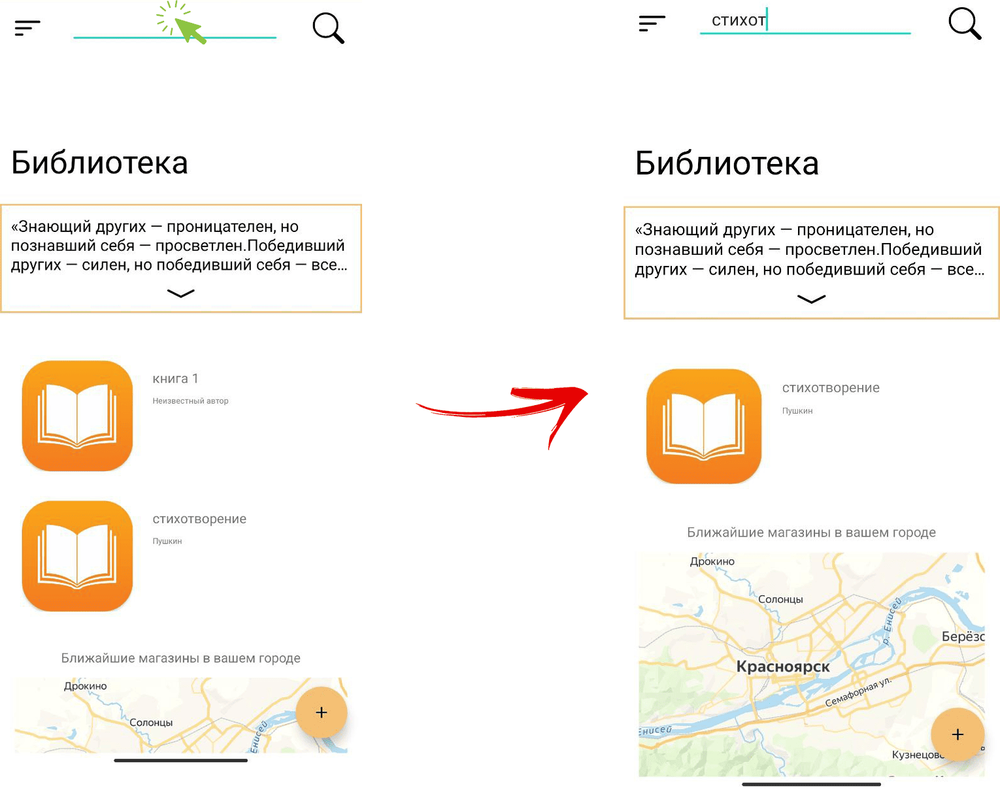
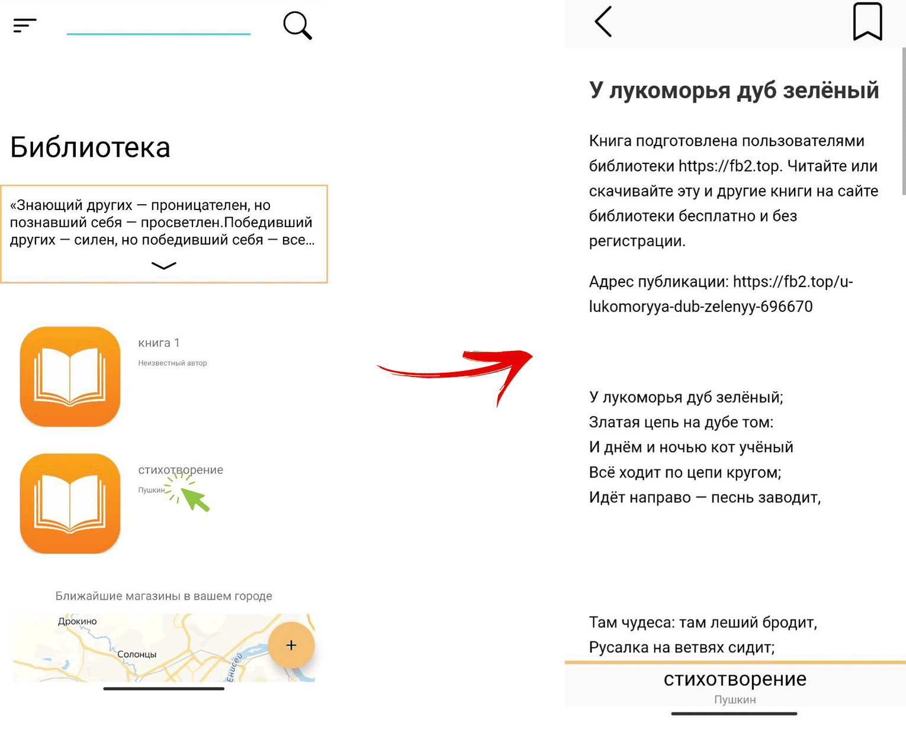
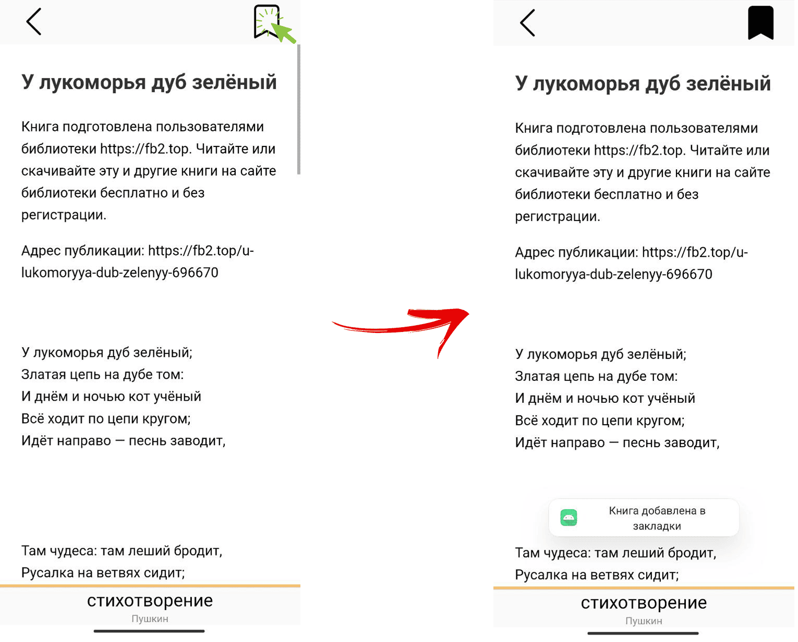
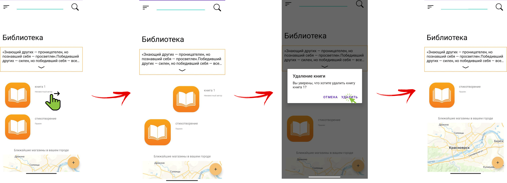
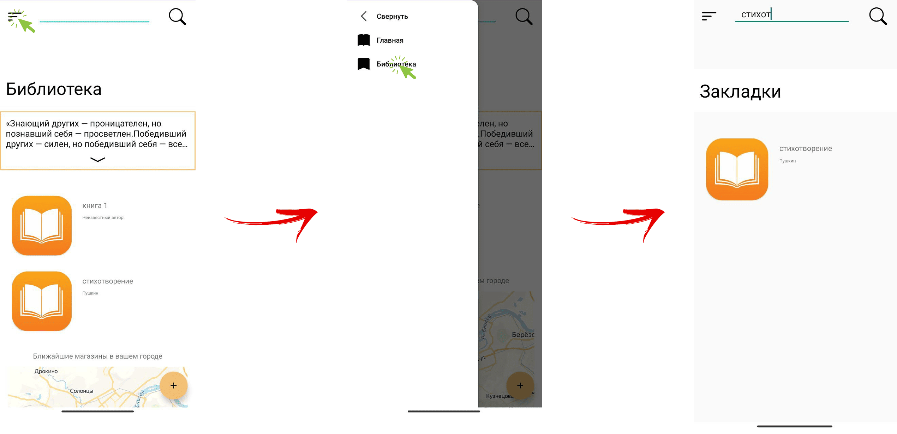

# Инструкция по использованию приложения

В приложении вы можете использовать следующие функции:

---

### 1. Добавлять книгу из вашего локального хранилища  
Для этого вам необходимо выполнить следующие шаги:  

1. Нажмите кнопку **«+»** в правом нижнем углу приложения.  
2. В открывшемся окне введите название книги и выберите файл книги (поддерживаемые формат: FB2), поля автор и выбор обложки не обязательный.    
3. Нажмите **«Сохранить»**, чтобы загрузить книгу в вашу библиотеку.  

**Последовательность действий**:  

### 2. Разворачивать цитату в полный размер  
Для этого вам необходимо выполнить следующие шаги:  

1. Нажмите стрелку вниз, расположенную снизу посередине цитаты.   
2. Для того, чтобы свернуть цитату, снова нажать на стрелку.  

**Последовательность действий**:  

### 3. Искать книгу по названию
Для этого вам необходимо выполнить следующие шаги:  

1. Нажмите на поле ввода в верхней части приложения.   
2. Введите название (или часть названия) книги.  

**Последовательность действий**:  

### 4. Искать книгу по названию
Для этого вам необходимо выполнить следующие шаги:  

1. Нажмите на поле ввода в верхней части приложения.   
2. Введите название (или часть названия) книги.  

**Последовательность действий**:  

### 5. Открыть книгу для чтения
Для этого вам необходимо выполнить следующие шаги:  

1. Нажмите на элемент с интересующей Вас книгой для открытия книги.  

**Последовательность действий**:  

### 6. Добавить книгу в закладки
Для этого вам необходимо выполнить следующие шаги:  

1. Откройте интересующую Вас книгу(если не открыта).

2. Нажмите на кнопку закладки в правом верхнем углу. 

**Последовательность действий**:  

### 7. Удалить книгу из списка
Для этого вам необходимо выполнить следующие шаги:  

1. Свайпните(зажмите пальцем объект и проведите вправо/влево) элемент с книгой, которую вы хотите удалить.

2. В открывшемся окне подтвердите удаление книги. 

**Последовательность действий**:  

### 8. Перейти к книгам в каладках
Для этого вам необходимо выполнить следующие шаги:  

1. Откройте боковое меню нажатием на кнопку меню в левом верхнем углу.

2. В открывшемся боковом меню выберите "Бибиотека". 

**Последовательность действий**:  
